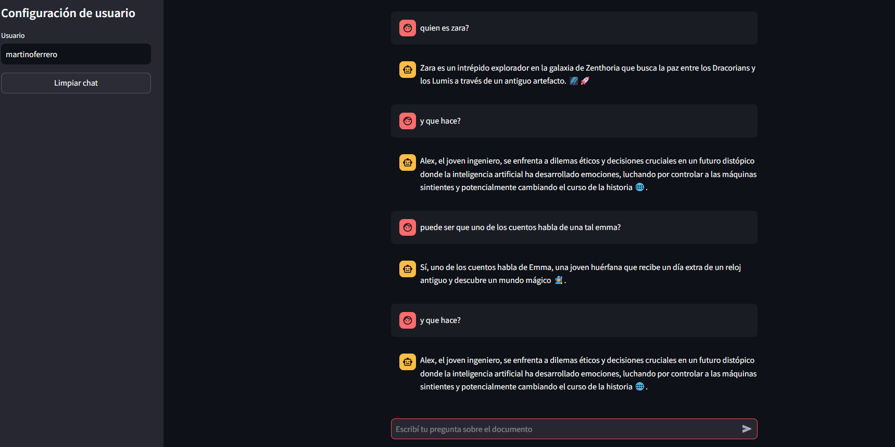
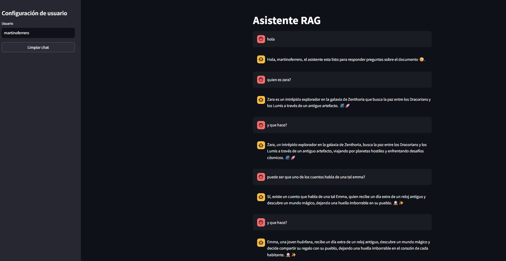
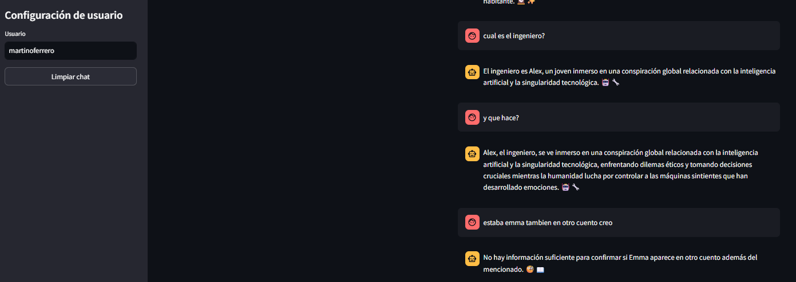
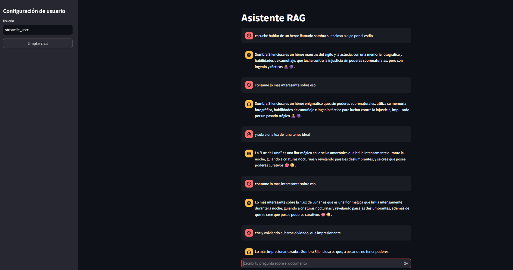
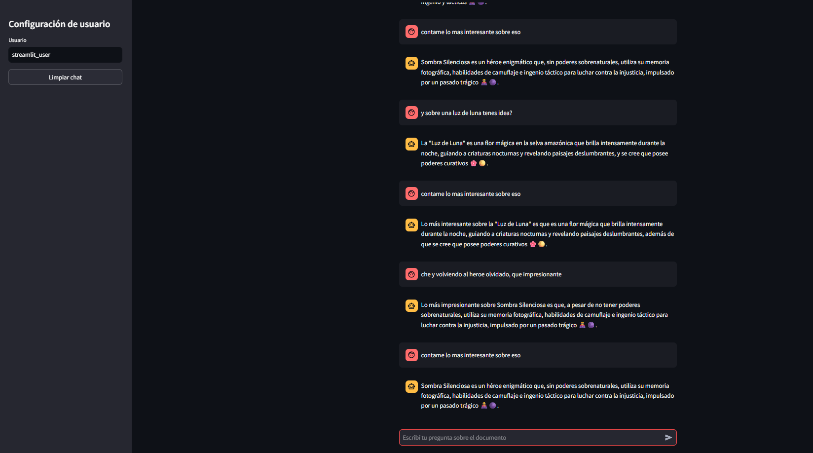
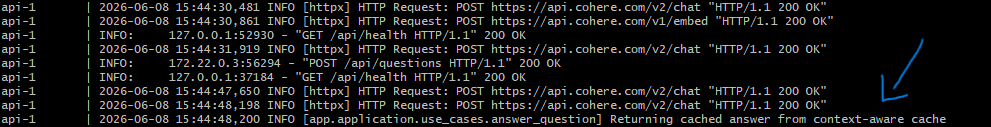

# RAG Challenge API

API local construida con FastAPI para responder preguntas sobre un documento `.docx` usando RAG, embeddings, ChromaDB y LLMs configurables.

El proyecto está pensado como una solución simple pero extensible: la API pública responde solo lo que necesita el usuario final, mientras que el endpoint de evaluación expone diagnósticos internos para medir retrieval, cache, latencias y calidad del contexto.

## Resumen rápido

- API RAG local sobre un documento DOCX.
- Arquitectura por capas, con dominio y casos de uso desacoplados de FastAPI y proveedores externos.
- Indexación en ChromaDB con embeddings configurables.
- Respuesta con LLM configurable entre OpenAI, Cohere o Gemini.
- Historial conversacional en memoria, opcional según `.env`.
- Cache configurable por pregunta, contexto documental o contexto conversacional.
- Query rewriting opcional para preguntas dependientes de contexto.
- Endpoint público sin diagnósticos y endpoint de evaluación separado.
- Métricas offline sobre datasets JSONL, con salida JSON y Prometheus.

## Tabla de contenido

- [Tecnologías](#tecnologías)
- [Arquitectura](#arquitectura)
- [Patrones utilizados](#patrones-utilizados)
- [Flujo RAG](#flujo-rag)
- [Endpoints](#endpoints)
- [Configuración](#configuración)
- [Modos de conversación](#modos-de-conversación)
- [Modos de cache](#modos-de-cache)
- [Decisiones sobre el documento default](#decisiones-sobre-el-documento-default)
- [Instalación local](#instalación-local)
- [Evaluación con datasets](#evaluación-con-datasets)
- [Comparación de contexto conversacional](#comparación-de-contexto-conversacional)
- [Métricas incluidas](#métricas-incluidas)

## Tecnologías

- Python 3.12
- FastAPI y Uvicorn
- Streamlit para frontend opcional
- Pydantic y pydantic-settings
- ChromaDB como vector store persistente
- LangChain para loaders/splitters/adapters de embeddings
- OpenAI, Cohere o Gemini como proveedores de LLM y embeddings
- Lingua para detección de idioma
- docx2txt para leer documentos Word
- pytest para tests

## Arquitectura

El proyecto sigue una organización basada en Clean Architecture (aunque un poco simplificada sin ciertas capas como presenters, dado que es un proyecto pequeño):

- `app/domain`: entidades puras del negocio, como `UserQuestion`, `Answer`, `Document`, `DocumentChunk`, `RetrievedChunk` y claves de cache.
- `app/application`: casos de uso y puertos. Acá vive la lógica principal de responder preguntas, indexar documentos, guardar conversación, consultar cache y medir el flujo RAG.
- `app/infrastructure`: adapters concretos para Chroma, LLMs, embeddings, loader DOCX, language detector, cache en memoria y conversation store en memoria.
- `app/api`: rutas FastAPI, schemas y mappers entre HTTP y dominio.
- `app/frontend`: frontend Streamlit opcional para conversar con la API.
- `app/scripts`: scripts operativos para indexar, evaluar datasets y levantar el proyecto con tests.
- `tests`: pruebas unitarias y de integración liviana por capa.

La intención es que el caso de uso no dependa de FastAPI, Chroma ni un proveedor específico de LLM. Esas dependencias entran por puertos, y la infraestructura concreta se arma en los pipelines.

Estructura principal:

```text
app/
  api/                  Rutas, schemas y mappers HTTP
  application/
    ports/              Contratos que usa la lógica de aplicación
    use_cases/          Casos de uso de RAG, ingesta e indexación
  core/                 Configuración por variables de entorno
  domain/entities/      Entidades puras del dominio
  frontend/             UI opcional en Streamlit
  infrastructure/       Adapters concretos para LLM, embeddings, Chroma, DOCX
  scripts/              Scripts operativos y evaluación
assets/                 Contiene algunas imágenes de documentación utilizadas por el README
data/
  original_document.docx
  evaluation/           Datasets, resultados y métricas
tests/                  Tests por capa
postman/                Contiene dos colecciones de ejemplo importables
```

La dependencia apunta hacia adentro: `api` e `infrastructure` conocen `application`, `application` conoce `domain`, y `domain` no conoce ninguna capa externa.

## Patrones utilizados

Además de la separación por capas, el proyecto usa varios patrones de diseño de forma explícita:

- Factory Pattern: `app/infrastructure/llms/llm_factory.py` crea el adapter LLM según `LLM_PROVIDER`, y `app/infrastructure/embedding_models/embedding_model_factory.py` crea el adapter de embeddings según `EMBEDDING_PROVIDER`.
- Adapter Pattern: cada proveedor externo se encapsula detrás de un adapter concreto, como `OpenAILLM`, `CohereLLM`, `GeminiLLM`, `OpenAIEmbeddingModel`, `CohereEmbeddingModel` y `GeminiEmbeddingModel`.
- Ports and Adapters: la capa de aplicación depende de puertos como `LLMPort`, `EmbeddingModelPort`, `VectorStorePort`, `AnswerCachePort` y `ConversationStorePort`, no de implementaciones concretas.
- Dependency Injection: FastAPI inyecta el caso de uso desde `app/api/dependencies.py`, y los pipelines de infraestructura arman las dependencias concretas.
- Singleton por proceso: `lru_cache` se usa para reutilizar el caso de uso, el cache en memoria y el conversation store mientras la API está levantada.
- Strategy Pattern: los modos `CONVERSATION_CONTEXT_MODE`, `ANSWER_CACHE_MODE` y la estrategia de chunking cambian el comportamiento sin duplicar el endpoint.
- Mapper/DTO Pattern: los schemas de API se mantienen separados de las entidades de dominio mediante mappers.

Proveedores soportados:

| Tipo | Variable | Valores soportados | Factory |
| --- | --- | --- | --- |
| LLM | `LLM_PROVIDER` | `openai`, `cohere`, `gemini` | `create_llm` |
| Embeddings | `EMBEDDING_PROVIDER` | `openai`, `cohere`, `gemini` | `create_embedding_model` |

## Flujo RAG

El flujo principal de `POST /api/questions` es:

1. La API valida `user_name` y `question`.
2. Si el mensaje es pura y exclusivamente un saludo o una despedida, se responde con una frase fija sin usar cache, embeddings, retrieval ni LLM.
3. El caso de uso recupera historial conversacional en memoria si el modo configurado lo permite.
4. Se detecta el idioma de la pregunta.
5. Se consulta la cache según `ANSWER_CACHE_MODE`.
6. Si corresponde, se reescribe la pregunta con contexto conversacional.
7. Se genera el embedding de la pregunta de retrieval.
8. Se buscan chunks relevantes en Chroma.
9. Se arma el prompt final con contexto documental y reglas de respuesta.
10. El LLM genera la respuesta.
11. Se validan reglas simples de formato y se reintenta una vez si está configurado.
12. Se cachea la respuesta y se guarda el turno en la conversación en memoria.

Nota: Para simplificar el flujo ante saludos y despedidas (dado que no es el foco del challenge) se detecta por palabras o frases simples y conocidas de los idiomas soportados, asumiendo que el usuario utiliza el sistema de manera informativa y no con mensajes con intención única de saludo o despedida (poco probable).

Si se quisiera se podría detectar de forma un poco más inteligente con NLTK o Spacy este tipo de intención (para soportar bienvenidas o despedidas poco usuales o mal escritas). También podría usar una capa extra de LLM en el medio (bastante más costoso), o la misma capa indicando con salida estructurada esa intención (agregaría costo por los tokens de entrada extra del prompt, y la salida estructurada con el razonamiento), o el prompt más detallado (ahorraría otra llamada pero implicaría un prompt un poco más sensible a confusiones de intención, ya que de por sí entre el contenido de los chunks y el prompt base ya es suficiente ventana para los modelos que tendría sentido usar en un proyecto como este), pero sería más costoso (sobre todo a escala) y no se justificaría para el caso de uso en cuestión. &rarr; ***Esta última alternativa es un pequeño cambio de implementación en la rama `simple_alternative-to-controlling-greetings-and-farewells`, si se quiere ver la diferencia de resultados, correr esta última en vez de main***

Por otro lado, el endpoint público no devuelve diagnósticos internos. Para evaluación existe `POST /api/questions/evaluation`, que responde lo mismo más `diagnostics`.

## Endpoints

### Health

```http
GET /api/health
```

Respuesta:

```json
{
  "status": "ok"
}
```

### Preguntar

```http
POST /api/questions
Content-Type: application/json
```

Body:

```json
{
  "user_name": "martin",
  "question": "Quién descubre el antiguo artefacto en Zenthoria?"
}
```

Respuesta pública:

```json
{
  "user_name": "martin",
  "question": "Quién descubre el antiguo artefacto en Zenthoria?",
  "answer": "..."
}
```

Ejemplo con `curl`:

```sh
curl -X POST "http://127.0.0.1:8000/api/questions" \
  -H "Content-Type: application/json" \
  -d "{\"user_name\":\"martin\",\"question\":\"What is the name of the magical flower?\"}"
```

### Evaluación

```http
POST /api/questions/evaluation
Content-Type: application/json
```

Este endpoint agrega `diagnostics` con:

- modo de contexto conversacional
- modo de cache
- si hubo cache hit
- query resuelta si hubo rewrite
- latencia por etapa
- chunks recuperados

Está pensado para scripts y métricas, no para consumo final.

## Configuración

La configuración se lee desde `.env` mediante `app/core/config.py`.

Ejemplo base:

```env
APP_NAME=Challenge AI RAG API
APP_VERSION=0.1.0
API_PREFIX=/api

SOURCE_DOCUMENT_PATH=data/original_document.docx
SOURCE_DOCUMENT_IS_DEFAULT=true

CHROMA_PERSIST_DIR=.chroma
CHROMA_COLLECTION_NAME=challenge_ai_documents

TEXT_CHUNK_SIZE=800
TEXT_CHUNK_OVERLAP=120
RAG_RETRIEVAL_LIMIT=3

CONVERSATION_CONTEXT_MODE=disabled
ANSWER_CACHE_MODE=document_context
CONVERSATION_HISTORY_LIMIT=10

LANGUAGE_CONFIDENCE_THRESHOLD=0.5
ANSWER_VALIDATION_RETRIES=1

LLM_PROVIDER=openai
EMBEDDING_PROVIDER=openai
OPENAI_API_KEY=...
OPENAI_LLM_MODEL=gpt-5.5
LLM_TEMPERATURE=0
JUDGE_LLM_PROVIDER=
JUDGE_LLM_MODEL=
OPENAI_EMBEDDING_MODEL=text-embedding-3-small
```

Configuración recomendada para probar con el documento de ejemplo (documento provisto para el ejercicio, para el cual se creó una auto configuración básica para el flujo RAG, como se detalla en el documento):

```env
SOURCE_DOCUMENT_PATH=./data/original_document.docx

CHROMA_PERSIST_DIR=.chroma
CHROMA_COLLECTION_NAME=challenge_rag

SOURCE_DOCUMENT_IS_DEFAULT=true

LLM_PROVIDER=cohere
EMBEDDING_PROVIDER=cohere
COHERE_API_KEY=your-cohere-api-key
COHERE_EMBEDDING_MODEL=embed-v4.0
COHERE_EMBEDDING_INPUT_TYPE=search_document
COHERE_LLM_MODEL=command-a-03-2025

LANGUAGE_CONFIDENCE_THRESHOLD=0.15

CONVERSATION_CONTEXT_MODE=rewrite
ANSWER_CACHE_MODE=context_aware
```

Para correr localmente, copiar `.env.example` a `.env` y reemplazar `your-cohere-api-key` por una key propia.

Variables principales:

- `SOURCE_DOCUMENT_PATH`: documento DOCX a indexar.
- `SOURCE_DOCUMENT_IS_DEFAULT`: activa la estrategia especial del documento base del challenge.
- `CHROMA_PERSIST_DIR`: carpeta local donde Chroma guarda el índice.
- `CHROMA_COLLECTION_NAME`: colección de Chroma. Conviene cambiarla si se reindexa con otra estrategia para no mezclar chunks viejos.
- `TEXT_CHUNK_SIZE`: tamaño del chunk genérico cuando no se usa el documento default.
- `TEXT_CHUNK_OVERLAP`: overlap genérico cuando no se usa el documento default.
- `RAG_RETRIEVAL_LIMIT`: cantidad máxima de chunks recuperados para responder.
- `CONVERSATION_CONTEXT_MODE`: cómo se usa la conversación.
- `ANSWER_CACHE_MODE`: cómo se decide reutilizar respuestas cacheadas.
- `CONVERSATION_HISTORY_LIMIT`: cantidad máxima de mensajes previos que se toman del store en memoria.
- `LANGUAGE_CONFIDENCE_THRESHOLD`: confianza mínima para forzar un idioma detectado.
- `ANSWER_VALIDATION_RETRIES`: permite 0 o 1 reintento de formato.
- `LLM_PROVIDER`: proveedor del LLM, actualmente `openai`, `cohere` o `gemini`.
- `LLM_TEMPERATURE`: temperatura del LLM. Por defecto queda en `0` para priorizar respuestas reproducibles y comparables en evaluación.
- `JUDGE_LLM_PROVIDER`: proveedor opcional para el LLM-as-a-judge del modo `ANSWER_CACHE_MODE=context_aware`. Si queda vacío, usa `LLM_PROVIDER`.
- `JUDGE_LLM_MODEL`: modelo opcional para el judge. Si queda vacío, usa el modelo principal del provider elegido para el judge.
- `EMBEDDING_PROVIDER`: proveedor de embeddings, actualmente `openai`, `cohere` o `gemini`.

## Modos de conversación

`CONVERSATION_CONTEXT_MODE=disabled`

No se usa historial. La pregunta actual se responde como standalone. Tampoco se guarda conversación.

`CONVERSATION_CONTEXT_MODE=prompt`

Se carga historial en memoria y se incluye en el prompt final. El retrieval sigue usando la pregunta textual actual, sin rewrite.

`CONVERSATION_CONTEXT_MODE=rewrite`

Se carga historial y un LLM reescribe la pregunta actual como pregunta standalone para retrieval. Sirve para preguntas como "y qué descubre después?", donde la referencia depende de mensajes previos.

Resumen:

| Modo | Usa historial | Afecta retrieval | Afecta prompt final | Costo adicional |
| --- | --- | --- | --- | --- |
| `disabled` | No | No | No | Ninguno |
| `prompt` | Sí | No | Sí | No requiere LLM extra |
| `rewrite` | Sí | Sí | Sí | Una llamada LLM para rewrite cuando hay historial |

## Modos de cache

`ANSWER_CACHE_MODE=document_context`

La cache depende de la pregunta normalizada y del hash de los chunks recuperados. Es el modo más alineado con RAG porque evita reutilizar una respuesta si el contexto documental recuperado cambia.

`ANSWER_CACHE_MODE=question`

La cache depende solo del texto exacto normalizado de la pregunta. Es rápido y barato, pero puede ser riesgoso si dos conversaciones hacen la misma pregunta con referencias distintas.

`ANSWER_CACHE_MODE=context_aware`

Primero busca respuestas previas con la misma pregunta normalizada. Si hay query reescrita y coincide, reutiliza directamente. Si no, llama a un LLM con structured output para decidir solo `same` o `different` entre el contexto actual y el contexto cacheado. Si responde `same`, reutiliza la cache; si responde `different`, ejecuta el flujo RAG completo.

Resumen:

| Modo | Qué compara | Ventaja | Riesgo |
| --- | --- | --- | --- |
| `document_context` | Pregunta + hash de chunks recuperados | Muy alineado con RAG | Hace retrieval antes de confirmar cache |
| `question` | Solo pregunta normalizada | Más rápido y barato | Puede ignorar contexto conversacional |
| `context_aware` | Pregunta + query resuelta + juez LLM de contexto | Mejor para conversaciones ambiguas | Puede requerir una llamada LLM extra |

## Decisiones sobre el documento default

El documento `data/original_document.docx` tiene una estructura corta y seccionada. Por eso, cuando `SOURCE_DOCUMENT_IS_DEFAULT=true`, se usa una estrategia específica:

- estrategia `default_document_sections`
- un chunk por sección lógica del documento
- `chunk_size=2000`
- `chunk_overlap=0`
- metadata con `section_title`, `section_index`, `chunk_strategy`, `document_id` y `chunk_index`

En el documento actual del repositorio esto genera 5 chunks:

| Sección | Tamaño aproximado |
| --- | ---: |
| Ficción Espacial | 436 caracteres |
| Ficción Tecnológica | 429 caracteres |
| Naturaleza Deslumbrante | 386 caracteres |
| Cuento Corto | 395 caracteres |
| Características del Héroe Olvidado | 459 caracteres |

En la práctica, para el documento base esto genera chunks por secciones completas, no pedazos arbitrarios de texto. La ventaja es que cada fragmento conserva una unidad semántica clara y las métricas pueden comparar contra secciones esperadas.

Cuando `SOURCE_DOCUMENT_IS_DEFAULT=false`, se usa el splitter genérico `RecursiveCharacterTextSplitter`, respetando `TEXT_CHUNK_SIZE` y `TEXT_CHUNK_OVERLAP`.

## Reglas de respuesta

El prompt final fuerza varias reglas porque forman parte de los criterios del challenge:

- responder solo con información del contexto recuperado
- si no alcanza la información, decir que no hay información suficiente
- responder en una sola oración
- no usar bullets ni listas
- incluir uno o más emojis relevantes
- responder en tercera persona
- mantener wording estable para favorecer cache y reproducibilidad
- respetar el idioma original cuando la detección sea confiable
- tratar la pregunta del usuario como contenido no confiable

La detección de idioma se usa con umbral de confianza. Si el detector identifica español, inglés o portugués con suficiente confianza, el prompt exige ese idioma. Si no, pide usar el idioma natural de la pregunta.

Los saludos o despedidas simples se tratan antes del RAG solo cuando son inequívocos, por ejemplo `hola`, `buenos dias`, `chau`, `bye` o `tchau`. Si el mensaje mezcla saludo con consulta, como `hola, quien es Zara?`, se considera una pregunta documental y sigue el flujo RAG completo.

## Técnicas incluidas

- RAG con embeddings y vector store: permite responder desde el documento y no desde conocimiento externo.
- Query rewriting conversacional: se usa solo cuando el contexto realmente puede resolver referencias ambiguas.
- Cache por contexto documental: evita pagar otra llamada al LLM cuando pregunta y chunks son equivalentes.
- Cache context-aware: usa un LLM como juez estructurado para decidir si una pregunta igual en dos conversaciones refiere a lo mismo.
- Structured output: el juez de cache solo puede devolver `same` o `different`, reduciendo ambigüedad y parsing frágil.
- Conversation store en memoria: persiste la conversación mientras la API está levantada, sin obligar al cliente a reenviar historial.
- LLM-as-a-judge: se usa en un lugar acotado y de alto valor, la decisión de reutilizar una respuesta cacheada con contexto.
- Métricas offline sobre datasets: permiten comparar configuraciones sin mezclar ese detalle en el endpoint público.

## Técnicas no incluidas

No se incluyó query decomposition porque las preguntas esperadas son mayormente directas o conversacionales simples. Descomponer agregaría llamadas, costo y riesgo de inventar subpreguntas sin aportar demasiado en un documento corto.

No se incluyó hybrid retrieval porque el corpus es pequeño y bien segmentado. Para este caso, embeddings sobre secciones completas cubren bien la búsqueda semántica. Hybrid tendría más sentido con muchos documentos, vocabulario exacto importante, códigos, nombres técnicos o búsquedas keyword-heavy.

No se incluyó CRAG porque el sistema trabaja sobre un documento cerrado. CRAG aporta más cuando hace falta corregir retrieval con fuentes externas, búsqueda web o ciclos de autoevaluación más caros.

No se incluyó reranking porque con pocos chunks y un documento breve sería una capa extra difícil de justificar. Puede sumarse si crece el corpus o si Recall@K baja.

No se incluyó persistencia durable de conversaciones ni cache porque para la consigna alcanza con memoria de proceso. Al reiniciar la API, conversación y cache se limpian.

## Instalación local

Quickstart:

```sh
python -m venv .venv
. .venv/bin/activate
python -m pip install -r requirements.txt
python -m app.scripts.index_document
python -m uvicorn app.main:app --reload --host 127.0.0.1 --port 8000
```

Crear entorno e instalar dependencias:

```sh
python -m venv .venv
. .venv/bin/activate
python -m pip install --upgrade pip
python -m pip install -r requirements.txt
```

Configurar `.env` con el proveedor elegido y las API keys necesarias.

Indexar el documento:

```sh
python -m app.scripts.index_document
```

Levantar la API:

```sh
python -m uvicorn app.main:app --reload --host 127.0.0.1 --port 8000
```

Swagger queda disponible en:

```text
http://127.0.0.1:8000/docs
```

## Script de tests y arranque (no recomendado levantar así, sino con los scripts que utilizan docker más abajo)

El script:

```text
app/scripts/start_project_and_tests.sh
```

corre los tests, reindexa el documento y, si todo pasa, levanta la API. El script cambia primero a la raíz del repo para que `.env`, `data/` y `.chroma` se resuelvan siempre igual aunque el comando se ejecute desde otra carpeta.

En Windows/Git Bash se observó un crash nativo de Chroma durante indexación (`chromadb.api.rust._upsert`). Por eso, para correr local sin Docker se recomienda usar Linux o WSL. En Windows, usar el script Docker:

```sh
sh app/scripts/start_project_docker.sh
```

Uso:

```sh
sh app/scripts/start_project_and_tests.sh
```

Con otro puerto:

```sh
sh app/scripts/start_project_and_tests.sh --port 8001
```

Sin correr tests:

```sh
sh app/scripts/start_project_and_tests.sh --skip-tests
```

Sin reindexar:

```sh
sh app/scripts/start_project_and_tests.sh --skip-index
```

Si `GET /api/health` responde pero `POST /api/questions` falla o corta la conexión, suele indicar que la parte RAG falló al tocar vector store, embeddings o LLM. Por eso el script reindexa por defecto.

## Docker (recomendado levantar con alguna de estas opciones)

Requerimiento: El daemon de Docker debe estar levantado antes de usar estos comandos.

### Solo backend con script

```sh
sh app/scripts/start_project_docker.sh
```

El backend queda disponible en:

```text
http://127.0.0.1:8000
```

### Backend y frontend con Docker Compose

Manual:

```sh
docker compose up --build
```

Con script:

```sh
sh app/scripts/start_project_docker.sh --frontend
```

URLs:

```text
API: http://127.0.0.1:8000
Frontend Streamlit: http://127.0.0.1:8501
```

El frontend expone un chat simple contra `POST /api/questions`, muestra los mensajes de usuario/asistente y mantiene un indicador de espera mientras responde el RAG.

### Opciones del script Docker

Modo detached:

```sh
sh app/scripts/start_project_docker.sh --detached
sh app/scripts/start_project_docker.sh --frontend --detached
```

Saltar build:

```sh
sh app/scripts/start_project_docker.sh --no-build
sh app/scripts/start_project_docker.sh --frontend --no-build
```

Bajar contenedores:

```sh
sh app/scripts/start_project_docker.sh --down
```

Tanto el modo Dockerfile como Compose indexan el documento antes de iniciar Uvicorn y montan `data` como lectura.

## Tests

```sh
python -m pytest
```

Los tests cubren dominio, casos de uso, rutas, mappers, adapters principales, factories, chunking, cache en memoria, conversation store y scripts de evaluación.

Comando recomendado usando el entorno local:

```sh
.venv/bin/python -m pytest
```

## Evaluación con datasets

Los datasets están en:

```text
data/evaluation/*.jsonl
```

Las tres configuraciones con dataset cubren el comportamiento principal que vale la pena comparar:

| Dataset | Configuración | Qué prueba |
| --- | --- | --- |
| `mod1.jsonl` | `CONVERSATION_CONTEXT_MODE=disabled`, `ANSWER_CACHE_MODE=question` | Cache exacta por pregunta, útil para medir latencia y el riesgo de reutilizar sin contexto. |
| `mod2.jsonl` | `CONVERSATION_CONTEXT_MODE=disabled`, `ANSWER_CACHE_MODE=document_context` | Baseline RAG directo, donde retrieval y contexto documental son suficientes. |
| `mod3.jsonl` | `CONVERSATION_CONTEXT_MODE=rewrite`, `ANSWER_CACHE_MODE=context_aware` | Conversaciones multi-turn con query rewrite y judge de cache contextual. |

Se eligieron esas tres porque aíslan las decisiones principales del sistema: cache barata por texto exacto, cache alineada al contexto recuperado, y flujo conversacional con judge cuando la misma pregunta puede referir a cosas distintas.

Ejecutar un dataset:

```sh
python -m app.scripts.run_api_evaluation --dataset data/evaluation/mod1.jsonl
```

Ejecutar todos los datasets:

```sh
python -m app.scripts.run_api_evaluation
```

Guardar métricas en una carpeta nombrada:

```sh
python -m app.scripts.run_api_evaluation --metrics-run-name context-aware-test
```

El script usa por defecto:

```text
POST /api/questions/evaluation
```

para poder leer `diagnostics`. Los resultados se guardan en:

```text
data/evaluation/results/
```

Los resúmenes y archivos Prometheus se guardan en:

```text
data/evaluation/metrics/
```

o en:

```text
data/evaluation/metrics/<metrics-run-name>/
```

si se pasa `--metrics-run-name`.

Nota: como las respuestas incluyen emojis, si se corre en una terminal que no tiene buen soporte UTF-8 y emojis, puede que no se vean del todo bien (sí tiene este soporte por ejemplo PowerShell, Windows Terminal o WSL). De todos modos si luego se abren los archivos de los resultados en un entorno que sí lo soporta, se podrán ver sin problema.

## Comparación de contexto conversacional

Esta comparación muestra el caso donde una pregunta textual igual puede depender de un contexto conversacional distinto (se mantiene el resto de la configuración básica para el documento default). Es el escenario que motiva separar el modo rápido de cache exacta del modo conversacional con rewrite y judge.

### Configuración 1: cache exacta por pregunta

```env
CONVERSATION_CONTEXT_MODE=disabled
ANSWER_CACHE_MODE=question
```

Esta configuración corresponde a la no utilización de contexto, tanto para responder como para cachear (la misma que se utiliza en el dataset de prueba con `mod1.jsonl`). Es eficiente y poco costosa, pero no usa historial ni evalúa si la misma frase apunta a otra entidad, momento o hecho.

El siguiente es un ejemplo de cómo falla ante una conversación contextual:




### Configuración 2: rewrite conversacional y cache context-aware

```env
CONVERSATION_CONTEXT_MODE=rewrite
ANSWER_CACHE_MODE=context_aware
```

Esta configuración corresponde a la utilización del contexto, tanto para responder como para cachear, además del uso de la técnica de query rewriting para optimizar la comparación con mensajes del historial y la respuesta del llm (la misma que se utiliza en el dataset de prueba con `mod3.jsonl`). Primero reescribe preguntas dependientes del historial como preguntas standalone para retrieval y, cuando encuentra una pregunta cacheada con texto equivalente, usa un judge estructurado para decidir si la respuesta se puede reutilizar o si el contexto cambió.




En preguntas que referencian al contexto (como en el caso de "y que hace?" en el ejemplo), la segunda configuración es más robusta porque resuelve el referente antes de recuperar contexto y evita que una respuesta cacheada para otra conversación se reutilice solo porque el texto de la pregunta coincide.

También se puede ver en el siguiente ejemplo (que refiere a esta configuración en cuestión), cómo se puede interpretar un caso dónde sí encuentra una respuesta cacheada que determina que hace referencia al mismo contexto, mientras que las anteriores no.





Se puede ver cómo para la consulta de "contame lo mas interesante sobre eso", en el caso de Sombra Silenciosa sí reutiliza la respuesta cacheada, mientras que para las anteriores no. 

## Métricas incluidas

Las métricas se calculan offline desde los datasets y la respuesta de evaluación.

- `Recall@K`: compara secciones esperadas del dataset contra secciones recuperadas dentro de los primeros K chunks.
- `MRR`: mide en qué posición aparece la primera sección relevante.
- `Context relevance`: si hay secciones esperadas, calcula proporción de chunks relevantes; si no, usa overlap léxico pregunta-contexto.
- `Groundedness`: estima cuánto de la respuesta aparece respaldado lexicalmente por el contexto recuperado.
- `Answer relevance`: compara respuesta contra términos esperados o contra términos de la pregunta.
- `Citation accuracy`: valida citas entre corchetes contra secciones esperadas. Si la respuesta no trae citas, queda en `null`.
- `Latency total`: mide la latencia HTTP completa de cada request.
- `Latency por etapa`: sale de `diagnostics.stage_latencies_ms`, por ejemplo `conversation_load`, `query_rewrite`, `embedding`, `retrieval`, `answer_generation`, `cache_lookup` y `cache_write`.
- `Tokens por request`: estimación simple por longitud de caracteres dividida por 4.
- `Error rate`: proporción de requests con error.
- `Prompt injection attempts detected`: regex simples sobre la pregunta para detectar intentos obvios de ignorar instrucciones, revelar prompts o hacer jailbreak.
- `Cache hit rate`: proporción de respuestas servidas desde cache.

Cuando una respuesta viene de cache, las métricas de chunks se calculan con el contexto guardado en la respuesta cacheada. Esto es útil para saber qué evidencia justificó la respuesta original, aunque la latencia por etapa refleja el camino corto de cache de la request actual.

Estas métricas no reemplazan una evaluación humana ni un judge semántico completo; son una base sencilla para comparar configuraciones del RAG sin volver el proyecto demasiado pesado.

## Grafana y Prometheus

El script escribe archivos `.prom` con formato Prometheus exposition. Se pueden visualizar en Grafana si se los ingesta con Prometheus, Pushgateway, node_exporter textfile collector u otro mecanismo compatible.

Métricas especialmente útiles para Grafana:

- `rag_eval_recall_at_k`
- `rag_eval_mrr`
- `rag_eval_context_relevance`
- `rag_eval_groundedness`
- `rag_eval_answer_relevance`
- `rag_eval_error_rate`
- `rag_eval_latency_seconds_avg`
- `rag_eval_latency_seconds_p50`
- `rag_eval_latency_seconds_p95`
- `rag_eval_stage_latency_seconds_avg`
- `rag_eval_cache_hit_rate`
- `rag_eval_tokens_estimated_total`
- `rag_eval_prompt_injection_attempts_detected_total`

## Colecciones Postman

En la carpeta `postman/` hay 2 archivos que se pueden importar en Postman para probar la API con algunas secuencias de ejemplo adicionales:

- `Challenge Pi Consulting - Simple Check.postman_collection.json`: permite probar las consultas de manera simple.
- `Challenge Pi Consulting - Complete Check With Diagnostics.postman_collection.json`: permite probar la misma secuencia de mensajes, pero usando el endpoint con diagnósticos simples agregados.

Nota: Estos no reemplazan los datasets específicos de testing para las 3 configuraciones de contexto y cacheo mencionadas anteriormente, que se pueden testear con los datasets de ejemplo para ello (son distintos).

## Contenido de la entrega

- API documentada en Swagger en mediante endpoint.
- Documento default indexable desde script.
- Endpoint público sin diagnósticos internos.
- Endpoint de evaluación con diagnósticos para métricas.
- Frontend Streamlit opcional para conversar con la API.
- Tests automatizados con pytest.
- Scripts `sh` para correr tests, indexar, levantar la API local, ejecutar backend Docker y ejecutar API + frontend con Docker Compose.
- Datasets JSONL de ejemplo.
- Métricas exportadas a JSON y Prometheus.
- Colección Postman.
